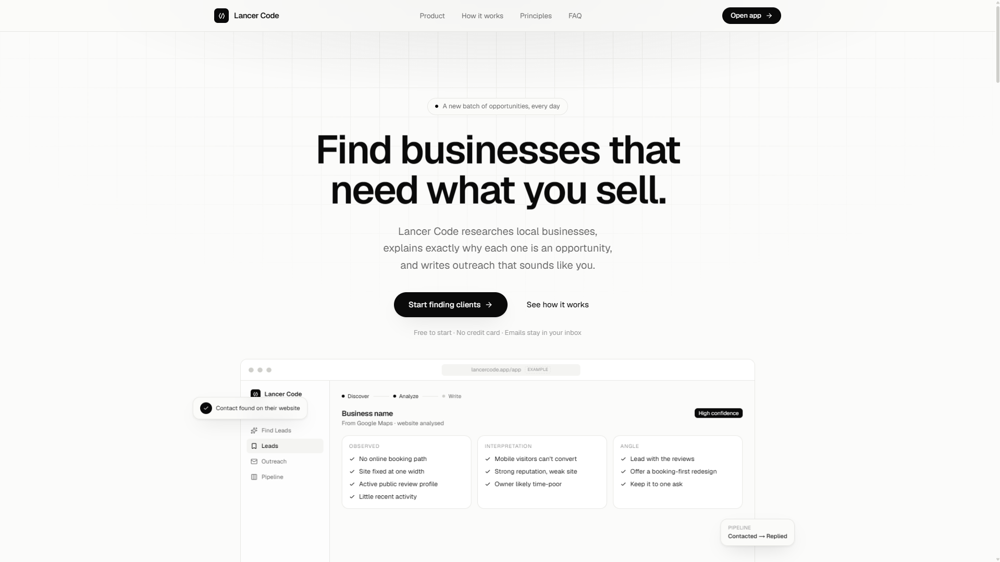
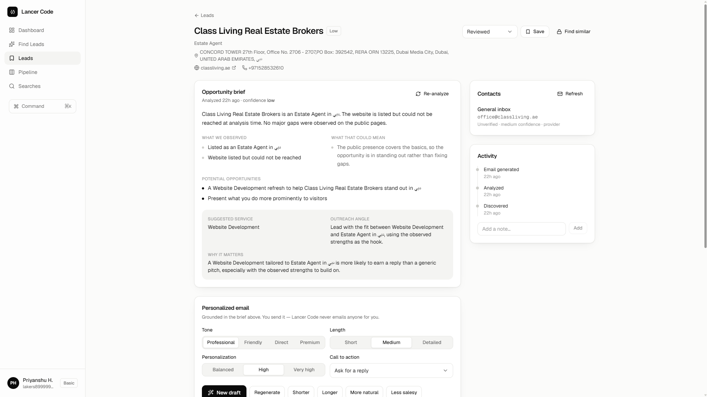
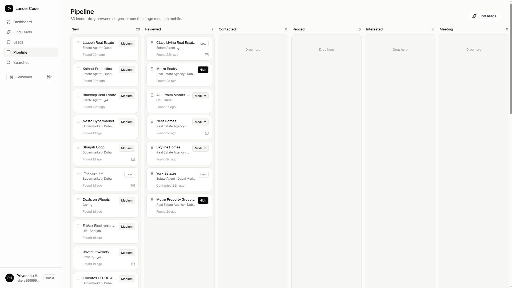

<div align="center">

# Lancer Code

### Find businesses that need what you sell.

**Research. Reason. Write. Win.**

Lancer Code is a prospecting platform built for freelancers and independent service providers who want to find real businesses that could benefit from their services — understand *why* they're a good opportunity — and turn that research into personalized outreach.

<br />

[](https://lancer-code.vercel.app/)
[](#)
[](#)
[](#)

<br />

> **Lancer Code doesn't just give you a list of businesses.**
>
> It researches the opportunity, explains the reasoning, and helps you write outreach that sounds like you.

<br />

[**🚀 Try Lancer Code →**](https://lancer-code.vercel.app/)

</div>

---

## ✦ What is Lancer Code?

Finding freelance clients is rarely difficult because there are no businesses to contact.

It's difficult because freelancers have to repeatedly:

* search for businesses
* identify potential prospects
* inspect websites
* understand what is actually wrong
* decide whether the business is worth contacting
* find an outreach angle
* write a personalized email
* remember who they contacted
* follow up
* avoid contacting the same business twice

Lancer Code brings that workflow into one place.

### The core idea

```text
Discover
   ↓
Research
   ↓
Understand
   ↓
Find the Opportunity
   ↓
Write Personalized Outreach
   ↓
Send From Your Own Inbox
   ↓
Track The Relationship
```

The goal isn't to generate more spam.

The goal is to help freelancers have **better conversations with better prospects.**

---

# ✦ Product

Lancer Code is built around four core actions:

### 01 — Discover

Tell Lancer Code:

* What you sell
* Which industry you want to work with
* Where you want to find clients

Lancer Code then finds businesses matching your target.

---

### 02 — Analyze

Instead of returning a business name and hoping the freelancer figures everything else out, Lancer Code researches the opportunity.

Each opportunity is structured around:

```text
OBSERVED
What we can actually verify.

        ↓

INTERPRETATION
What those observations could mean.

        ↓

ANGLE
What the freelancer should lead with.

        ↓

CONFIDENCE
How strongly the opportunity is supported.
```

This separation is intentional.

**Facts should not be presented as guesses.**

---

### 03 — Write

Once an opportunity has been understood, Lancer Code turns the research into personalized outreach.

Users can control things like:

* Tone
* Length
* Directness
* CTA
* Sales intensity

Examples:

```text
Professional
Friendly
Direct
Shorter
Less Salesy
Regenerate
```

The goal is not to make every freelancer sound like the same AI-generated salesperson.

The goal is to help them communicate **in their own voice.**

---

### 04 — Manage

Finding a prospect is only the beginning.

Lancer Code provides a lightweight pipeline to move opportunities through stages such as:

```text
NEW
 ↓
CONTACTED
 ↓
REPLIED
 ↓
MEETING
 ↓
WON
```

Each lead can carry:

* Notes
* Follow-up history
* Current stage
* Contact information
* Research
* Outreach history

So the workflow doesn't end after clicking "Generate."

---

# ✦ Opportunity Briefs

One of the core concepts behind Lancer Code is the **Opportunity Brief**.

A traditional lead database might give you:

```text
Business Name
Website
Phone
Address
Rating
```

That's useful — but incomplete.

Lancer Code aims to answer the question that actually matters:

> **"Why should I contact this business?"**

An opportunity brief can look like:

### Observed

* No online booking path
* Website does not adapt well to mobile
* Strong public reviews
* Active business presence

### Interpretation

* Mobile visitors may have difficulty converting
* The business appears to have stronger reputation than digital presentation
* Website may be limiting potential bookings

### Outreach Angle

* Lead with the business's existing reputation
* Connect it to the booking experience
* Offer a specific improvement rather than a generic website pitch

### Confidence

```text
HIGH
████████████████░░ 86%
```

The confidence system exists to prevent one of the biggest problems in automated prospecting:

**turning assumptions into facts.**

---

# ✦ Built for Better Outreach

Lancer Code follows a simple principle:

> **Built to earn replies, not to spam inboxes.**

That means:

### You send every email.

Lancer Code does **not** send emails on your behalf.

It prepares the research and draft.

You decide what actually leaves your inbox.

---

### Public information first.

The product is designed around publicly available business information such as:

* Business websites
* Public directories
* Public listings
* Public reviews
* Publicly available business information

No private information is required to understand the basic opportunity.

---

### Facts before opinions.

Research is deliberately separated into:

```text
What we know
      ↓
What it could mean
      ↓
How confident we are
      ↓
How to approach the prospect
```

That makes the outreach easier to review before sending.

---

# ✦ The Daily Workflow

Lancer Code is designed around a simple daily prospecting habit.

```text
┌─────────────────────────────────────┐
│          YOUR TARGET PROFILE        │
│                                     │
│  Service: Website Development       │
│  Industry: Restaurants              │
│  Location: Your City                │
└─────────────────┬───────────────────┘
                  │
                  ▼
┌─────────────────────────────────────┐
│             DISCOVER                │
│                                     │
│        Find matching businesses     │
└─────────────────┬───────────────────┘
                  │
                  ▼
┌─────────────────────────────────────┐
│              ANALYZE                │
│                                     │
│   Website + public business data    │
│             ↓                       │
│       Opportunity Brief             │
└─────────────────┬───────────────────┘
                  │
                  ▼
┌─────────────────────────────────────┐
│               WRITE                 │
│                                     │
│      Personalized outreach          │
│      + follow-up sequence           │
└─────────────────┬───────────────────┘
                  │
                  ▼
┌─────────────────────────────────────┐
│               SEND                  │
│                                     │
│       You send from your inbox      │
└─────────────────┬───────────────────┘
                  │
                  ▼
┌─────────────────────────────────────┐
│              MANAGE                 │
│                                     │
│  New → Contacted → Replied → Won   │
└─────────────────────────────────────┘
```

---

# ✦ Features

| Feature                    | Description                                         |
| -------------------------- | --------------------------------------------------- |
| 🔎 Business Discovery      | Find businesses matching your target market         |
| 🌐 Website Research        | Understand a prospect's online presence             |
| 🧠 Opportunity Reasoning   | Turn observations into actionable outreach angles   |
| 📊 Confidence Levels       | Distinguish strong evidence from weaker assumptions |
| ✍️ Personalized Outreach   | Generate outreach around the actual opportunity     |
| 🎛️ Tone Controls          | Adjust style, length and directness                 |
| 🔁 Follow-ups              | Prepare coherent follow-up sequences                |
| 📋 Lead Pipeline           | Track prospects from discovery to conversion        |
| 📝 Notes                   | Keep context attached to every lead                 |
| 🛡️ Duplicate Protection   | Avoid repeatedly contacting the same businesses     |
| 📱 Mobile Friendly         | Manage opportunities from desktop or mobile         |
| 📬 User-Controlled Sending | Emails remain under the user's control              |

---

# ✦ Why Lancer Code?

Traditional lead generation usually looks like:

```text
Search
  ↓
Huge list of businesses
  ↓
Open websites manually
  ↓
Figure out what is wrong
  ↓
Write a generic pitch
  ↓
Repeat
```

Lancer Code aims to turn that into:

```text
Search
  ↓
Relevant opportunities
  ↓
Research already organized
  ↓
Reasoning already structured
  ↓
Personalized outreach
  ↓
Send
```

### Less time researching.

### Less time writing.

### More time actually talking to potential clients.

---

# ✦ Product Philosophy

Lancer Code is built around a few principles.

## 1. Research before outreach

Don't contact someone simply because their business exists.

Understand the opportunity first.

---

## 2. Specific beats generic

Compare:

> "Hi, I noticed your business could benefit from a new website."

with:

> "I noticed your site doesn't currently provide a clear mobile booking path, despite the strong customer feedback you're already getting."

The second message gives the prospect a reason to care.

---

## 3. Evidence before assumptions

A prospecting system shouldn't confidently invent problems.

That's why Lancer Code separates:

```text
Observed
Interpretation
Angle
Confidence
```

---

## 4. The user stays in control

Lancer Code assists with research and writing.

The freelancer decides:

* Who to contact
* What to say
* Whether to send
* When to follow up
* How to manage the relationship

---

## 5. Don't optimize for spam volume

More leads aren't necessarily better.

**Better leads + better reasoning + better outreach = better prospecting.**

---

# ✦ Who is Lancer Code for?

Lancer Code is primarily designed for independent service providers.

### Freelancers

* Web developers
* Web designers
* UI/UX designers
* SEO freelancers
* Copywriters
* Marketing freelancers
* Video editors
* Brand designers
* Automation specialists
* Software developers

### Small agencies

Agencies can use the same workflow to continuously discover businesses that fit their ideal client profile.

### Solo founders

Anyone selling a digital or professional service can use the system to build a repeatable outbound pipeline.

---

# ✦ Example

Imagine you're a freelance web developer.

You configure:

```yaml
Service:
Website Design & Development

Industry:
Restaurants & Cafés

Location:
Your City
```

Instead of manually searching dozens of businesses, Lancer Code produces opportunities.

For example:

```text
Business:
Example Restaurant

Confidence:
HIGH

Observed:
• No online booking path
• Website has poor mobile adaptation
• Strong public reviews

Interpretation:
• Mobile visitors may struggle to convert
• Existing reputation could support stronger digital conversion

Angle:
• Lead with the booking experience
• Reference existing customer reputation

CTA:
15-minute conversation
```

Then Lancer Code helps turn that research into an outreach draft.

The freelancer reviews it.

The freelancer sends it.

The relationship stays with the freelancer.

---

# ✦ Architecture

At a high level, Lancer Code follows a modular pipeline:

```text
                 ┌──────────────────┐
                 │  User Profile    │
                 │                  │
                 │ Service          │
                 │ Industry         │
                 │ Location         │
                 └────────┬─────────┘
                          │
                          ▼
                 ┌──────────────────┐
                 │   Discovery      │
                 │                  │
                 │ Business Search  │
                 │ Filtering        │
                 │ Deduplication    │
                 └────────┬─────────┘
                          │
                          ▼
                 ┌──────────────────┐
                 │    Research      │
                 │                  │
                 │ Website          │
                 │ Public Signals   │
                 │ Business Data    │
                 └────────┬─────────┘
                          │
                          ▼
                 ┌──────────────────┐
                 │    Reasoning     │
                 │                  │
                 │ Observations     │
                 │ Interpretation   │
                 │ Opportunity      │
                 │ Confidence       │
                 └────────┬─────────┘
                          │
                          ▼
                 ┌──────────────────┐
                 │     Writing      │
                 │                  │
                 │ Personalization  │
                 │ Tone             │
                 │ CTA              │
                 │ Follow-ups       │
                 └────────┬─────────┘
                          │
                          ▼
                 ┌──────────────────┐
                 │    Pipeline      │
                 │                  │
                 │ New              │
                 │ Contacted        │
                 │ Replied          │
                 │ Meeting          │
                 │ Won              │
                 └──────────────────┘
```

---

# ✦ Cost-Conscious Architecture

A major design goal behind Lancer Code is keeping variable infrastructure costs low.

The architecture is intentionally designed to avoid unnecessary per-lead AI inference and expensive third-party dependencies wherever practical.

The product can use:

* Public business discovery sources
* Website research
* Local/template-based outreach logic
* Deterministic processing where possible
* User-controlled email sending

This means the economics can remain attractive as usage grows.

### Current philosophy

```text
Expensive API call
       ↓
Every lead
       ↓
Every customer
       ↓
High variable cost
```

is replaced wherever possible with:

```text
Reusable logic
       +
Public data
       +
Local processing
       +
Template systems
       ↓
Low marginal cost
```

This architecture is especially important for a product whose core value is **finding and researching large numbers of potential prospects.**

---

# ✦ Product Economics

Lancer Code is designed around a low-variable-cost model.

The platform does not need to send emails itself, which removes the need to operate an outbound email infrastructure for users.

The goal is to keep the majority of infrastructure costs predictable:

```text
                 ┌──────────────────────┐
                 │     Lancer Code      │
                 └──────────┬───────────┘
                            │
          ┌─────────────────┼─────────────────┐
          ▼                 ▼                 ▼
     Discovery          Research          Writing
          │                 │                 │
          └─────────────────┼─────────────────┘
                            ▼
                    User sends email
                    from own inbox
```

This makes the product much easier to scale than a system that sends every email itself.

---

# ✦ Daily Opportunities

The product is designed around a recurring prospecting loop.

A user can receive a fresh batch of businesses in their chosen niche rather than repeatedly researching the same businesses.

Previously discovered businesses can be identified so the user doesn't accidentally treat the same company as a brand-new prospect.

The intended workflow becomes:

```text
Day 1 → Find → Contact
Day 2 → Find → Contact → Follow up
Day 3 → Find → Contact
Day 4 → Find → Contact → Follow up
...
```

Over time, this creates a consistent outbound habit instead of random prospecting.

---

# ✦ Follow-Up System

Most outreach doesn't end after one email.

Lancer Code can prepare a sequence of follow-ups based on the same original opportunity brief.

That matters because the messaging remains coherent.

Instead of:

```text
Email 1 → Generic pitch

Email 2 → Completely different pitch

Email 3 → "Just checking in"
```

the intended flow is:

```text
Opportunity
    ↓
Initial outreach
    ↓
Follow-up #1
    ↓
Follow-up #2
    ↓
Follow-up #3
```

Every message stays connected to the same reason the business was considered an opportunity.

---

# ✦ Privacy & Control

Lancer Code follows a user-controlled workflow.

### We don't send emails for you.

Your inbox remains yours.

### We focus on publicly available information.

The product is designed to work with public business information rather than private databases.

### You review before sending.

Generated outreach is a draft — not an autonomous message sent without your approval.

---

# ✦ Roadmap

> The roadmap is intentionally flexible as the product evolves.

### ✅ Current

* [x] Business discovery
* [x] Prospect research
* [x] Opportunity briefs
* [x] Confidence levels
* [x] Personalized outreach
* [x] Tone controls
* [x] Follow-up drafts
* [x] Lead pipeline
* [x] Duplicate detection
* [x] Mobile-friendly workflow

### 🚧 In Progress

* [ ] More industries
* [ ] More prospect signals
* [ ] Better opportunity scoring
* [ ] Improved personalization
* [ ] Advanced pipeline analytics
* [ ] More outreach templates
* [ ] Better follow-up intelligence

### 🔭 Future

* [ ] Advanced ICP targeting
* [ ] Lead quality scoring
* [ ] Multi-location prospecting
* [ ] Team workflows
* [ ] Advanced analytics
* [ ] Agency features
* [ ] CRM integrations
* [ ] Additional data sources

---

# ✦ Tech Stack

> Update this section to match the exact implementation in the repository.

### Frontend

* Modern web application
* Responsive UI
* Desktop + mobile workflow
* Component-based interface

### Backend

* API-driven architecture
* Business discovery layer
* Research pipeline
* Opportunity reasoning
* Outreach generation
* Lead management

### Data

* Public business information
* Public websites
* Public listings/directories
* Public review signals

### Infrastructure

* Vercel deployment
* Serverless-friendly architecture
* Database-backed user/lead state

---

# ✦ Repository Structure

```text
lancer-code/
│
├── app/
│   ├── ...
│   └── ...
│
├── components/
│   ├── ...
│   └── ...
│
├── lib/
│   ├── ...
│   └── ...
│
├── public/
│   ├── ...
│   └── ...
│
├── README.md
├── package.json
└── ...
```

> Repository structure may evolve as the product architecture changes.

---

# ✦ Design Direction

Lancer Code intentionally uses a clean, product-first visual language.

### Design principles

```text
Minimal
Professional
Fast
Readable
Focused
```

The interface avoids unnecessary dashboards, visual noise and complicated workflows.

The primary question on every screen is:

> **What should the freelancer do next?**

---

# ✦ Screenshots


### Landing Page

<p align="center">
  
</p>

### Opportunity Brief

<p align="center">
  
</p>

### Lead Pipeline

<p align="center">
  
</p>

---

# ✦ Development Philosophy

Lancer Code isn't trying to become another massive CRM.

The product is deliberately focused on one problem:

> **Helping freelancers consistently find businesses they can actually help.**

Everything else should support that workflow.

---

# ✦ The Bigger Vision

Freelancers don't need another giant database of businesses.

They need **context**.

A list tells you:

> "Here is a restaurant."

A useful prospecting system tells you:

> "Here is a restaurant, here is what we observed, here is why it might matter, here is how confident we are, and here is a sensible reason to start a conversation."

That difference is the foundation of Lancer Code.

### From:

```text
Lead lists
```

### To:

```text
Opportunities
```

And eventually:

```text
Opportunity
      ↓
Conversation
      ↓
Relationship
      ↓
Client
```

---

# ✦ Contributing

Contributions, ideas and feedback are welcome.

If you find a bug or have an improvement:

1. Open an issue.
2. Explain the problem clearly.
3. Include reproduction steps where possible.
4. Submit a pull request if you have a proposed solution.

For larger changes, open an issue first so the direction can be discussed before implementation.

---

# ✦ Disclaimer

Lancer Code is a prospecting and outreach-assistance tool.

Users are responsible for:

* Reviewing generated content
* Verifying prospect information
* Following applicable laws and regulations
* Following applicable email and anti-spam requirements
* Using collected information responsibly

Lancer Code is designed to assist human-led outreach, not to encourage indiscriminate spam.

---

# ✦ Links

### Product

[**lancer-code.vercel.app**](https://lancer-code.vercel.app/)

### Repository

[**GitHub Repository**](https://github.com/)

---

<div align="center">

# Lancer Code

### Find businesses that need what you sell.

**Discover. Analyze. Write. Send.**

<br />

[🚀 **Start finding clients →**](https://lancer-code.vercel.app/)

<br />

---

**Built for freelancers who'd rather build than cold-search all day.**

© 2026 Lancer Code

</div>
